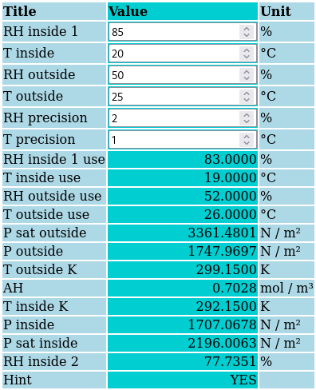
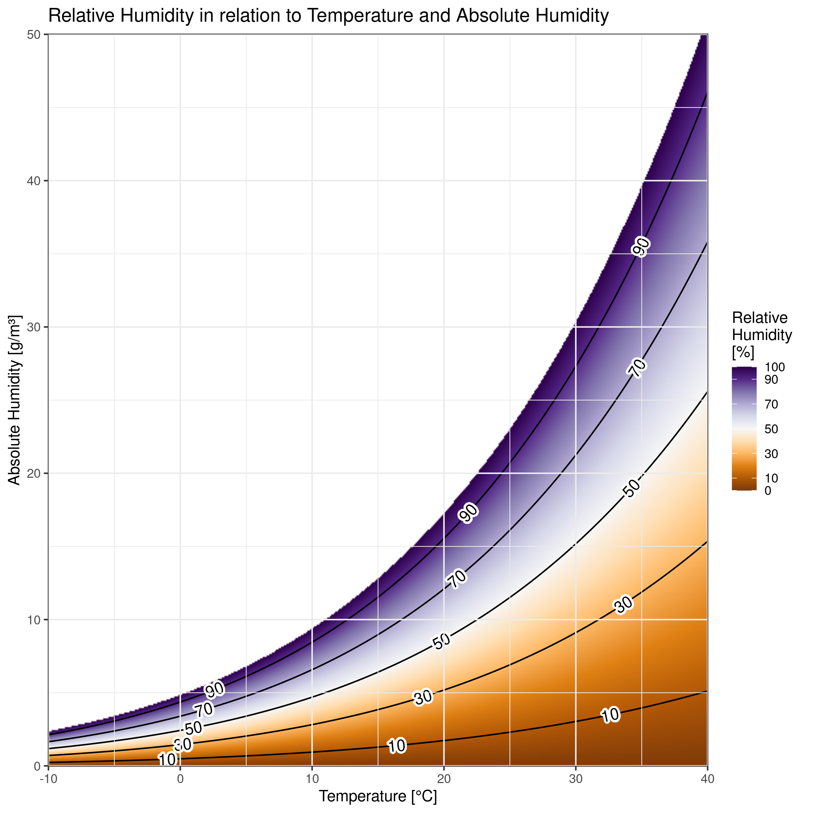
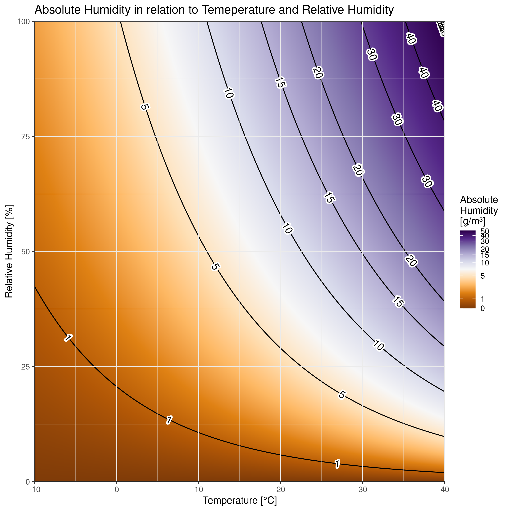

# RoomVentHint

Gives you a hint, if ventilating the air in a room (e.g. by opening the windows)
currently makes sense, based on momentary temperatures and relative humidities
measured inside and outside the room.

The rule of thumb is to open the windows when the temperature outside is the
same or lower than inside, only, to avoid increasing the humidity inside.

The calculations made here make ventilation possible under some circumstances,
even if it is warmer outside than inside without increasing humidity!

The math used is based on [this blog post](https://carnotcycle.wordpress.com/2012/08/04/how-to-convert-relative-humidity-to-absolute-humidity/)
by Peter Mander.

[Click here to get started.](https://rhinodevel.github.io/RoomVentHint/)

## Visualisation

Temperature, relative and absolute humidity form a three dimensional relationship that is often visualised using temperature and absolute humidity as x and y axis and the relative humidity as lines (e.g. in the [Wikipedia article on humidity](https://de.wikipedia.org/wiki/Luftfeuchtigkeit#/media/Datei:Luftfeuchte.png)). But this visualisation is oversimplified because it only shows the contours of equal relative humidity. The following plot shows a more complete visualisation of the 3D data using color as the third dimension:

To answer the question: "Should I open the window?", one has to 

 1. find the location where the vertical indoor temperature line crosses the line of indoor relative humidity
 2. find the location where the vertical outdoor temperature line crosses the line of outdoor relative humidity
 3. evaluate which of these points is further up in the graph, i.e. has a higher absolute humidity
 
An alternative representation of the same relationship plots the given values (temperature and relative humidity) on the two axes and color-codes the absolute humidity:

The question is now answered by 

 1. locating the point of the indoor givens in the grid
 2. locating the point of the outdoor givens in the grid
 3. judging, which of these has more absolute humidity

Both are of course still a simplification. As air expands through heating, a colder air package from outside will decrease its absolute humidity when heated to indoor temperature even without loosing any water content. This is because the absolute humidity is relative to the air volume. Therefore ventilation for humidity reduction can even be reasonable, if the outside absolute humidity is higher, but the temperature is lower than inside.

The graphs can be recreated using [this R script](HumidityGraphs.R).
